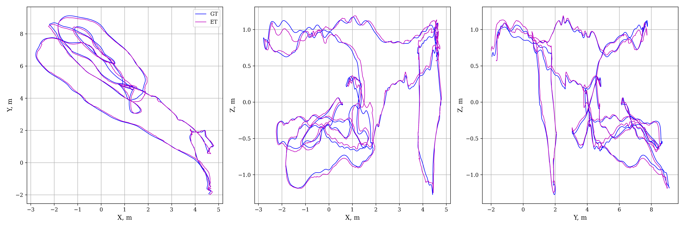
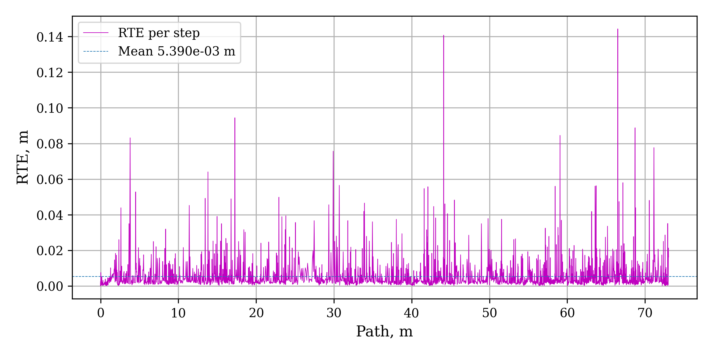

# UAV-Airvision

## О проекте
UAV AirVision — это высокоточный модуль визуально-инерциальной одометрии (VIO) для беспилотных летательных аппаратов (БПЛА).
Проект предназначен для оценки траектории движения с использованием стереокамер и IMU.
Архитектура реализована на базе MSCKF (Multi-State Constraint Kalman Filter) для слияния визуальных и инерциальных данных.

## Особенности
- Обработка и синхронизация данных IMU и стереокамер
- Оптический трекинг признаков с использованием LK-оптического потока
- Стерео соответствия и фильтрация на основе эпиполярных ограничений и RANSAC
- Инициализация и оптимизация 3D положения признаков с учётом малых углов
- Калмановская фильтрация MSCKF с поддержкой буфера состояний камеры
- Асинхронная обработка данных с использованием многопоточности
- Визуализация с 3D графикой и выводом текущих изображений
- Конфигурация под датасет EuRoC MAV с готовыми параметрами камер и IMU
- Поддержка запуска экспериментов с автоматическим перебором параметров сдвига времени

## Структура репозитория
```
├── config.py          # Конфигурации параметров камеры, IMU и фильтра
├── dataset.py         # Загрузка и предобработка датасета EuRoC MAV
├── publisher.py       # Публикация потоков данных (IMU, стерео)
├── pipeline.py        # Основной пайплайн обработки изображений и признаков
├── feature_*          # Классы и модули для трекинга, инициализации, добавления, прайнинга, публикации признаков
├── imu_processor.py   # Обработка и интеграция данных IMU
├── camera_model.py    # Модель камеры, дисторсия и коррекция точек
├── stereo_matcher.py  # Сопоставление стерео точек с фильтрацией
├── utils.py           # Вспомогательные функции (кватернионы, матрицы вращения и др.)
├── modules/
│   └── vio.py         # Класс VIO для обработки IMU и изображений
├── viewer.py          # Визуализация с PyQt и pyqtgraph 3D
├── main.py            # Точка входа, запуск эксперимента с параметрами
├── run.bat            # Скрипт для запуска экспериментов с перебором датасетов и оффсетов
├── requirements.txt   # Зависимости проекта
├── README.md          
└── results/           # Папка с результатами и логами
```

## Требования
- Python 3.10+
- OpenCV (cv2)
- NumPy
- PyQt5
- pyqtgraph
- SciPy

## Установка зависимостей:

```bash
pip install -r requirements.txt
```

## Быстрый старт

Скачайте и распакуйте датасет EuRoC MAV.
Укажите путь к датасету через параметр --path при запуске.

Запустите скрипт:

```bash
python main.py --path ./datasets/MH_01_easy --offset 10 --view

--offset — сдвиг времени в секундах для синхронизации данных IMU и камеры

--view — если задан, открывается визуализатор с 3D траекторией и изображениями
```

Результаты (траектория и состояние) сохраняются в папку results/txts/ с файлами с именами output_<dataset>_offset<offset>.txt.

## Архитектура

DataPublisher — асинхронно публикует сообщения из датасета в очереди  
VIO — обрабатывает IMU и изображения в отдельных потоках, вычисляет позицию с помощью MSCKF  
ImageProcessingPipeline — построение пирамиды изображений, трекинг, инициализация и добавление признаков, фильтрация  
MSCKF — расширенный фильтр Калмана, обновляющий ориентацию, позицию и смещения IMU и камер  
Viewer — визуализация результатов в реальном времени  

## Основные параметры конфигурации

- Настраиваются в config.py в классе ConfigEuRoC:  
- Параметры камеры (intrinsics, distortion, extrinsics)  
- Параметры фильтра (шум, пороги, максимальное количество состояний камеры)  
- Параметры трекинга (порог RANSAC, параметры LK, сетка распределения признаков)  

## Результаты и визуализация

- Система сохраняет оценённые траектории и состояния в папку `results/txts/` с файлами:  
  `output_<dataset>_offset<offset>.txt`  

- Эти результаты можно анализировать и визуализировать с помощью встроенных скриптов построения графиков или сторонних инструментов.  

- Визуализации включают:  
  - 3D графики траекторий с сравнением оценённого пути и эталонного  
  - Графики ошибок (например, Absolute Trajectory Error — ATE, Relative Pose Error — RPE)  
  - Живую визуализацию во время обработки (если запуск с опцией `--view`)  

### Примеры графиков

  
*Оценённая траектория и эталон.*  

  
*Абсолютная ошибка траектории по пути.*  

  
*Относительная ошибка траектории во времени.*  

  
*Сводная абсолютная ошибка траекторий.*  

  
*Сводная относительная ошибка траекторий.*  

## Примечания
Для запуска необходим оригинальный формат датасета EuRoC MAV.

Скрипт run.bat позволяет запускать серию экспериментов с разными сдвигами времени.

Код строго структурирован по классам и модулям для удобства расширения и тестирования.
