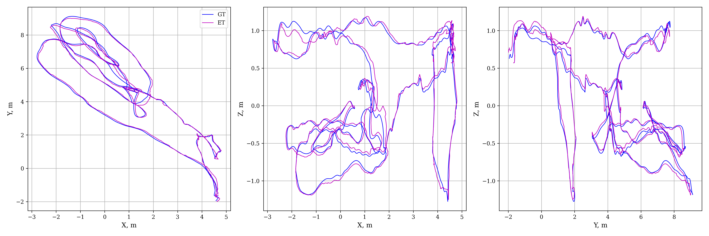
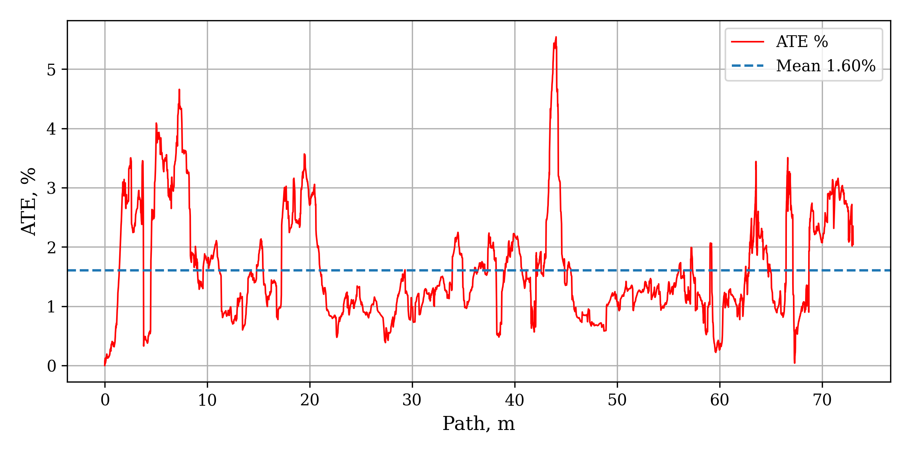
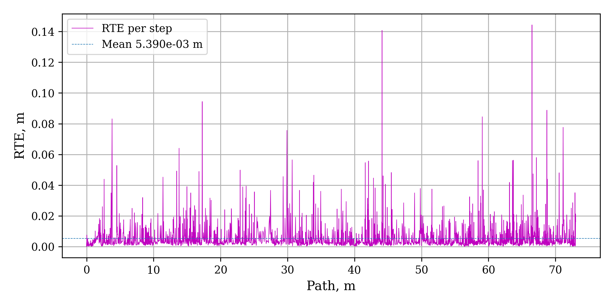
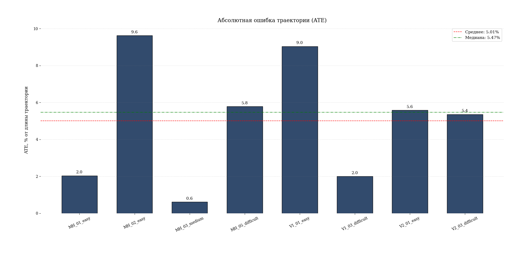
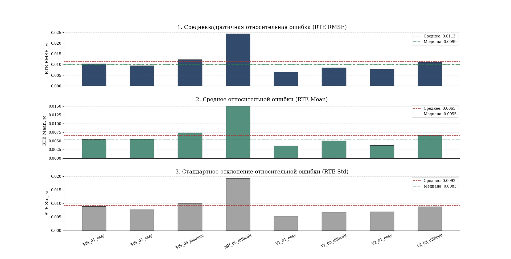

# UAV-Airvision

[](https://github.com/BUBLET/uav-airvision/blob/master/README.md)
[](https://github.com/BUBLET/uav-airvision/blob/master/README-ru.md)

## About
UAV AirVision is a high-precision visual-inertial odometry (VIO) module for unmanned aerial vehicles (UAVs).
The project is designed to estimate the motion trajectory using stereo cameras and an IMU.
The architecture is implemented based on MSCKF (Multi-State Constraint Kalman Filter) to fuse visual and inertial data.

## Features
- Processing and synchronization of IMU and stereo camera data
- Feature tracking using Lucas-Kanade optical flow
- Stereo matching and filtering based on epipolar constraints and RANSAC
- Initialization and optimization of 3D feature positions with small-angle assumptions
- MSCKF Kalman filtering with a camera state buffer support
- Asynchronous data processing with multithreading
- Visualization with 3D graphics and live image display
- Configuration for EuRoC MAV dataset with predefined camera and IMU parameters
- Support for running experiments with automatic time offset parameter sweeping

## Repository Structure
```graphql
├── config.py          # Camera, IMU, and filter parameter configurations
├── dataset.py         # Loading and preprocessing EuRoC MAV dataset
├── publisher.py       # Publishing data streams (IMU, stereo)
├── pipeline.py        # Main image and feature processing pipeline
├── feature_*          # Classes and modules for feature tracking, initialization, adding, pruning, publishing
├── imu_processor.py   # IMU data processing and integration
├── camera_model.py    # Camera model, distortion and point correction
├── stereo_matcher.py  # Stereo point matching with filtering
├── utils.py           # Utility functions (quaternions, rotation matrices, etc.)
├── modules/
│   └── vio.py         # VIO class handling IMU and image streams
├── viewer.py          # Visualization with PyQt and pyqtgraph 3D
├── main.py            # Entry point, experiment launch with parameters
├── run.bat            # Script to run experiments with dataset and offset sweeping
├── requirements.txt   # Project dependencies
├── README.md          
└── results/           # Folder with results and logs
```
## Requirements
- Python 3.10+
- OpenCV (cv2)
- NumPy
- PyQt5
- pyqtgraph
- SciPy

## Install dependencies:

```bash
pip install -r requirements.txt
```

## Quick Start

Download and extract the EuRoC MAV dataset.
Specify the dataset path with the --path argument when launching.

Run the script:

```bash
python main.py --path ./datasets/MH_01_easy --offset 10 --view

--offset — time shift in seconds to synchronize IMU and camera data

--view — if set, opens the visualizer with 3D trajectory and images
```

Results (trajectory and state) are saved to the results/txts/ folder as files named output_<dataset>_offset<offset>.txt.

## Architecture

DataPublisher — asynchronously publishes dataset messages into queues
VIO — processes IMU and images in separate threads, estimates position using MSCKF
ImageProcessingPipeline — image pyramid building, tracking, feature initialization and adding, filtering
MSCKF — Extended Kalman Filter updating orientation, position, and IMU/camera biases
Viewer — real-time result visualization

## Main configuration parameters

- Configured in config.py in the ConfigEuRoC class:
- Camera parameters (intrinsics, distortion, extrinsics)
- Filter parameters (noise, thresholds, max camera states)
- Tracking parameters (RANSAC threshold, LK parameters, feature distribution grid)

## Results and Visualization

- The system outputs estimated trajectories and states saved in the `results/txts/` folder as files named:
  
  `output_<dataset>_offset<offset>.txt`

- These results can be analyzed and visualized using included plotting scripts or external tools.

- Visualizations include:
  - 3D trajectory plots comparing estimated path vs ground truth
  - Error metrics graphs (e.g., Absolute Trajectory Error - ATE, Relative Pose Error - RPE)
  - Live visualization during processing (if run with `--view`)

### Example plots

  
*Estimated trajectory vs ground truth.*

  
*Absolute Trajectory Error over path.*


*Relative Trajectory Error over time.*


*Absolute Trajectory Error summary.*


*Relative Trajectory Error summary.*


## Notes
EuRoC MAV original dataset format is required to run the project.

The run.bat script allows running a series of experiments with different time offsets.

The code is strictly organized by classes and modules for ease of extension and testing.
